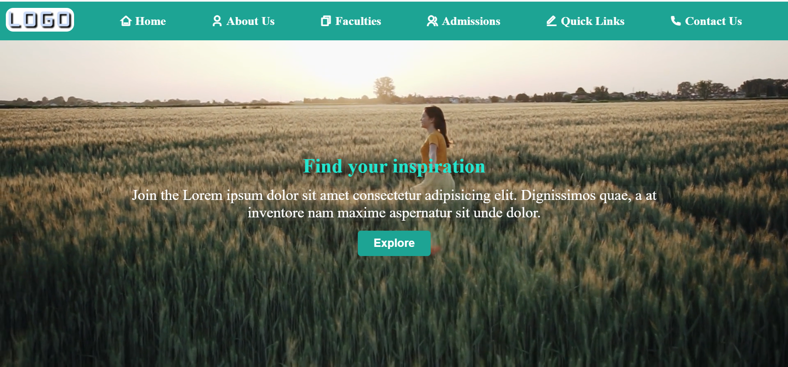
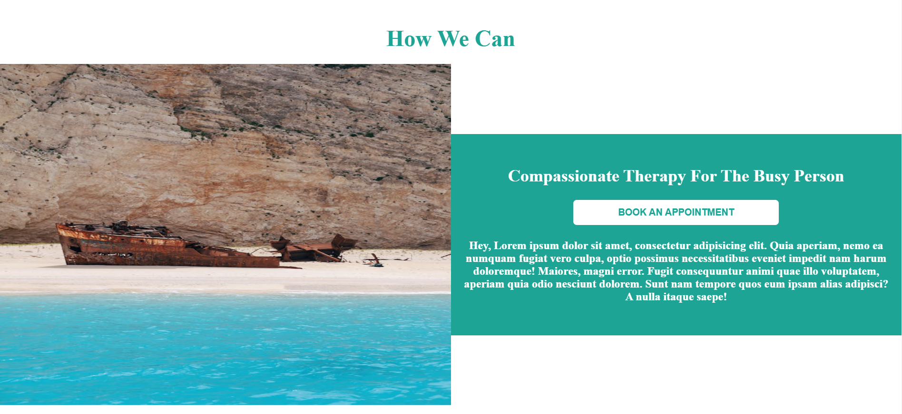
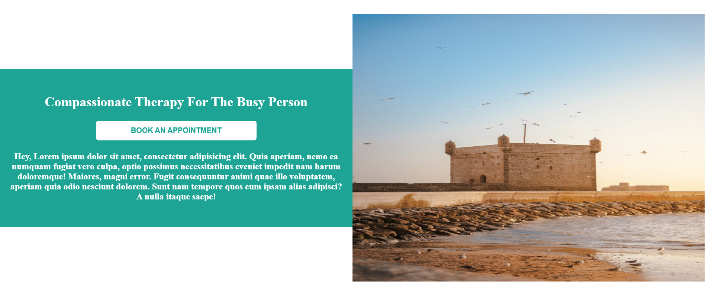
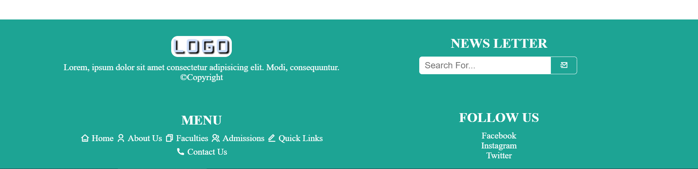

## **📌 Project Name**
**My Website** (or any suitable title for your project)

<!-- ## **🌍 Live Demo** -->
<!-- [🔗 Visit the Website](https://UmerFarooqJillani.github.io/Static-Website/)     -->
<!-- _(Replace with your actual GitHub Pages link.)_ -->

## **📖 About the Project**
A multi-page static website built using **HTML & CSS**.

## **📂 Folder Structure**
```
/Static-Website
│── index.html           # Home Page
│── about.html           # About Us Page
│── faculties.html       # Faculties Page
│── admissions.html      # Admissions Page
│── quick-links.html     # Quick Links Page
│── contact.html         # Contact Page
│── assets/
│   ├── css/
│   │   ├── home.css   # Main stylesheet
│   │   ├── about.css    # About page styles
│   │   ├── admissions.css # Admissions page styles
│   │   ├── faculties.css # Admissions page styles
│   │   ├── quick-links.css # Admissions page styles
│   │   ├── contact.css # Admissions page styles
│   ├── images/          # Images folder
│   ├── favicon.ico/     # Favicon Icon
└── README.md            # Project Documentation
```

## **🚀 Features**
- **Responsive Design**  
- **Multi-Page Navigation**  
- **CSS Styling**  
- **Organized File Structure**  

## **📜 Technologies Used**
- **HTML5**
- **CSS3**

## **📸 Screenshots (Optional)**


## **📬 Contact**
🔗 GitHub: [UmerFarooqJillani](https://github.com/UmerFarooqJillani)

---
